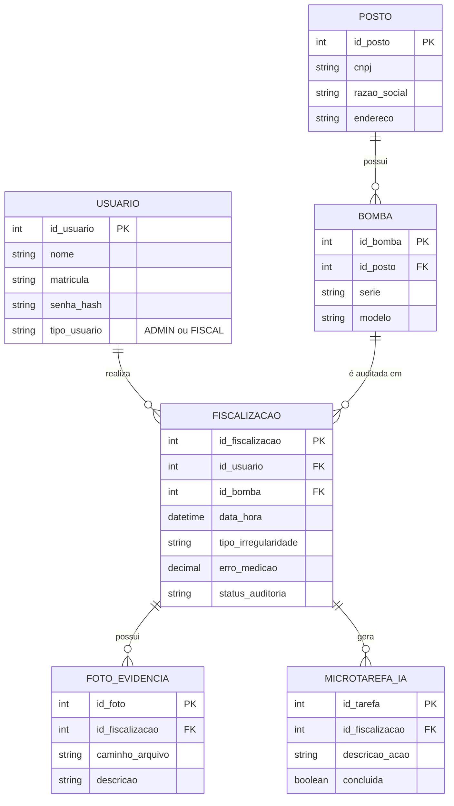

# 📄 Proposta de Projeto — A3

## SIAM - Sistema Inteligente de Auditoria Metrológica

---

## 👨‍🎓 Informações do Projeto

* **Alunos:**
  - Danilo Costa Bento
  - Letícia de Lima Silva
  - Leonardo Lopes Correia
  - José Victor Contierro
  - Renan dos Santos Souza
* **Curso:** Engenharia da Computação
* **Instituição:** Universidade São Judas Tadeu
* **Disciplina:** Programação de Soluções Computacionais
* **Semestre:** 2026/1
* **Professores:** Cristiane Fidelix e Erica Lopes

---

## 🌍 Alinhamento com ODS

Este projeto está alinhado aos seguintes Objetivos de Desenvolvimento Sustentável:

- ⚖️ **ODS 16 — Paz, Justiça e Instituições Eficazes**
- 🏗️ **ODS 9 — Indústria, Inovação e Infraestrutura**

**Justificativa:**

O sistema contribui para o fortalecimento de instituições reguladoras (ODS 16), ao mesmo tempo em que promove inovação tecnológica e modernização de processos industriais e de fiscalização (ODS 9), por meio do uso de Inteligência Artificial e digitalização de operações.

---

## 🧠 1. Resumo do Projeto

O SIAM é um sistema desktop desenvolvido em Java com o objetivo de otimizar o processo de fiscalização de bombas medidoras de combustíveis.

A solução digitaliza:

* Registro de autuações
* Armazenamento de evidências fotográficas
* Apoio à tomada de decisão

O diferencial do sistema é a integração com **Inteligência Artificial Generativa**, utilizando arquitetura **RAG (Retrieval-Augmented Generation)** para auxiliar fiscais com base em normas técnicas reais.

---

## 🚧 2. Justificativa e Motivação

A fiscalização metrológica enfrenta desafios como:

* Fraudes cada vez mais sofisticadas
* Grande volume de normas técnicas
* Alto risco de erros administrativos

O SIAM atua como um **assistente especialista**, reduzindo erros humanos, aumentando a eficiência e garantindo conformidade legal.

---

## 🎯 3. Objetivos

### 🎯 Objetivo Geral

Desenvolver uma aplicação desktop capaz de gerenciar fiscalizações e utilizar IA para gerar planos de ação automatizados com base em documentação técnica.

---

### 📌 Objetivos Específicos

* Implementar autenticação e controle de acesso
* Desenvolver interface gráfica intuitiva
* Criar banco de dados relacional
* Armazenar evidências fotográficas
* Construir base de conhecimento técnica
* Integrar com API de IA (Google Gemini)
* Implementar arquitetura RAG

---

## 🏗️ 4. Arquitetura do Sistema

O sistema seguirá o padrão:

### 🧩 Arquitetura

* **MVC (Model-View-Controller)**

### 💻 Tecnologias

* **Linguagem:** Java (JDK 17+)
* **Interface Gráfica:** `javax.swing`
* **Banco de Dados:** MySQL
* **Persistência:** JDBC + DAO
* **IA:** API Google Gemini
* **Concorrência:** Threads

---

## 🗄️ 5. Modelagem de Dados

Principais entidades:

* **Usuário**
* **Proprietário**
* **Fiscalização**
* **Foto de Evidência**
* **Base de Conhecimento Técnica**
* **Microtarefas (IA)**

---

## 🤖 6. Metodologia de IA (RAG)

O sistema utilizará a arquitetura RAG:

1. **Recuperação:** busca dados técnicos no banco
2. **Aumento:** combina dados com contexto da fiscalização
3. **Geração:** IA gera checklist estruturado
4. **Apresentação:** tarefas exibidas ao usuário

---

## ⚙️ 7. Requisitos do Sistema

### 🔐 Requisitos Funcionais

* RF01: CRUD de fiscalizações e proprietários
* RF02: Upload e visualização de fotos
* RF03: Filtros de busca avançados
* RF04: Gestão da base de conhecimento
* RF05: Geração de tarefas via IA
* RF06: Controle de acesso com autenticação
* RF07: Dois níveis de usuário (Admin e comum)
* RF08: Dashboard com métricas do sistema

---

### ⚡ Requisitos Não Funcionais

* RNF01: Aplicação desktop leve
* RNF02: Tempo de resposta < 2s
* RNF03: Senhas criptografadas
* RNF04: Interface responsiva
* RNF05: Sistema escalável e modular

---

## 📊 8. Dashboard (Obrigatório pelo Edital)

O sistema deverá apresentar:

* Total de fiscalizações
* Total de usuários
* Casos por tipo de fraude
* Reincidência por CNPJ

---

## 🗓️ 9. Cronograma

| Mês | Atividade                  |
| --- | -------------------------- |
| 1   | Levantamento de requisitos |
| 2   | Modelagem do banco         |
| 3   | Desenvolvimento backend    |
| 4   | Interface gráfica          |
| 5   | Integração com IA          |
| 6   | Testes e ajustes finais    |

---

## 📦 10. Entregáveis

* Sistema funcional desktop
* Banco de dados integrado
* Código no GitHub
* Vídeo demonstrativo
* Apresentação na banca

---

## ⚠️ 11. Observações Importantes

* O sistema seguirá os requisitos do edital da UC
* Deve conter:

  * Autenticação
  * 2 tipos de usuário
  * 3 CRUDs mínimos
  * Dashboard
* Um usuário administrador será criado diretamente no banco

---

## 🚀 12. Diferencial do Projeto

* Uso de IA com base normativa real
* Arquitetura RAG (nível acima do padrão da turma 👀)
* Aplicação prática em fiscalização real
* Alto potencial de impacto acadêmico e profissional

---

## 📌 Status do Projeto

🟡 Em fase de planejamento
