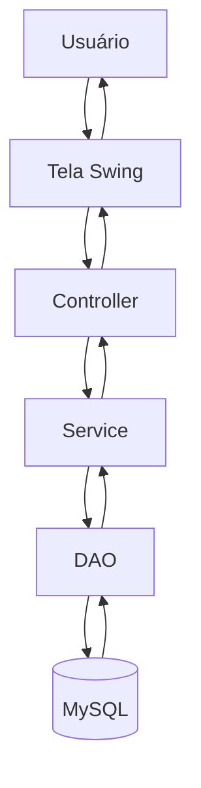
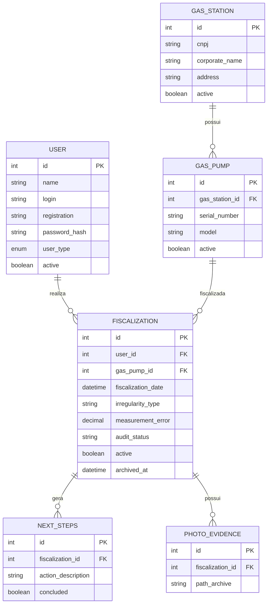
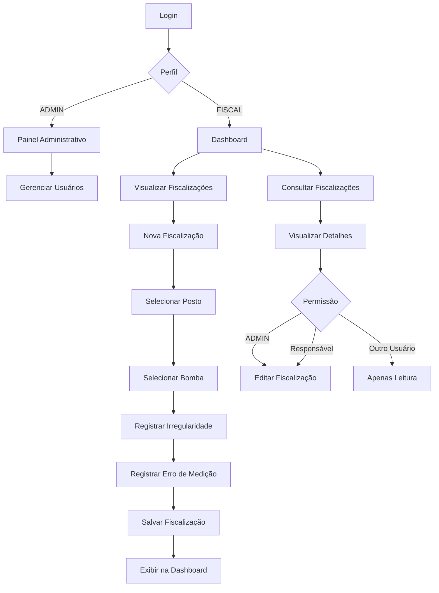

# 🚀 SIAM — Sistema Inteligente de Auditoria Metrológica

> Sistema desktop desenvolvido em Java para apoio às fiscalizações metrológicas, com foco em rastreabilidade, automação de processos e futura integração com Inteligência Artificial Generativa.

---

## Stacks


---

## 📌 Sobre o Projeto

O **SIAM (Sistema Inteligente de Auditoria Metrológica)** é uma aplicação desktop desenvolvida em **Java**, com interface gráfica em `javax.swing` e banco de dados **MySQL**.

O projeto nasceu com o objetivo de modernizar o processo de fiscalização de bombas de combustível realizado por órgãos reguladores, oferecendo maior controle operacional, rastreabilidade das inspeções e apoio à tomada de decisão.

O sistema está sendo desenvolvido como um MVP acadêmico inspirado em necessidades reais do **IPEM-SP**, sendo projetado desde o início para suportar futuras integrações com Inteligência Artifical, modelos RAG (Retrieval-Augmented Generation), evidÊncias fotográficas e automação de auditorias.

---

## 🎯 Objetivos

O SIAM busca:

- Centralizar informações de fiscalizações metrológicas;
- Controlar usuários e permissões de acesso;
- Gerenciar postos de combustível e bombas fiscalizadas;
- Registrar fiscalizações e irregularidades encontradas;
- Facilitar o acompanhamento das atividades dos fiscais;
- Preparar a base para utilização de Inteligência Artificial aplicada à fiscalização.

---

## 🌍 Objetivos de Desenvolvimento Sustentável (ODS)

Este projeto está alinhado com os seguintes objetivos da ONU:

🏗️ **ODS 9 — Indústria, Inovação e Infraestrutura**

Modernização dos processos de fiscalização através de soluções tecnológicas.

♻️ **ODS 12 - Consumo e Produção Responsáveis**

Combate a irregularidades que impactam diretamente consumidores e fornecedores.

⚖️ **ODS 16 — Paz, Justiça e Instituições Eficazes**

Fortalecimento da eficiência, transparência e confiabilidade das instituições fiscalizadoras.

---

## 🧠 Visão de Futuro

O SIAM foi concebido para evoluir além do MVP acadêmico.

Entreas funcionalidades planejadas estão:

- Integração com Inteligência Artificial Generativa;
- Implementação de arquitetura **RAG**;
- Base normativa integrada com portarias do Inmetro;
- Sugestão automática de microtarefas para fiscais;
- Análise inteligente de irregularidades;
- Upload e gerenciamento de evidências fotográficas;
- Histórico completo de auditorias;
- Dashboard analítico avançado;
- Integração com aplicações web e mobile.

---

## 🏗️ Arquitetura

O sistema segue o padrão:
**MVC (Model - View - Controller)**

Além disso, utiliza:
- DAO Pattern
- Service Layer Pattern
- JDBC
- MySQL
- Maven

Fluxo Principal:


<<<<<<< HEAD

### 🔧 Tecnologias Utilizadas

| Camada            | Tecnologia        |
|-------------------|-------------------|
| Linguagem         | Java 21           |
| Interface Gráfica | javax.swing       |
| Banco de Dados    | MySQL             |
| Persistência      | JDBC              |
| Arquitetura       | MVC               |
| Padrões           | DAO + Service     |
| Build Tools       | Maven             |
| IA (Planejado)    | Google Gemini API |
| IA (Planejado)    | RAG               |

---

## 📊 Funcionalidades Implementadas

=======

---

### 🔧 Tecnologias Utilizadas

| Camada            | Tecnologia        |
|-------------------|-------------------|
| Linguagem         | Java 21           |
| Interface Gráfica | javax.swing       |
| Banco de Dados    | MySQL             |
| Persistência      | JDBC              |
| Arquitetura       | MVC               |
| Padrões           | DAO + Service     |
| Build Tools       | Maven             |
| IA (Planejado)    | Google Gemini API |
| IA (Planejado)    | RAG               |

---

## 📊 Funcionalidades Implementadas

>>>>>>> a95b0e708fca8585402309421e8c25c930f96773
### ✅ Infraestrutura
- [X] Projeto Maven
- [X] Estrutura MVC
- [X] Configuração JDBC
- [X] Integração com MySQL
- [X] Controle de dependências

---

### 🔐 Autenticação
- [X] Tela de login
- [X] Login por e-mail
- [X] Login por matrícula
- [X] Criptografia de senha
- [X] Controle de sessão
- [X] Controle de acesso por perfil

---

### 👤 Gestão de Usuários
- [X] Cadastro de usuários
- [X] Listagem de usuários
- [X] Edição de usuários
- [X] Desativação lógica de usuários
- [X] Controle ADMIN / FISCAL
- [X] Paínel administrativo
- [X] Perfil do usuário

---

### ⛽ Gestão de Postos
- [X] Cadastro de postos
- [X] Pesquisa de postos
- [X] Listagem de postos
- [X] Edição de postos
- [X] Desativação de postos


### ⛽ Gestão de Bombas
- [X] Cadastro de bombas
- [X] Pesquisa de bombas
- [X] Listagem de bombas
- [X] Edição de bombas
- [X] Desativação de bombas
---

### 📋 Gestão de Fiscalização
- [X] Cadastro de fiscalizações
- [X] Listagem de fiscalizações
- [X] Pesquisa de fiscalizações
- [X] Visualização detalhada
- [X] Edição de fiscalizações
- [X] Controle de permissões
- [X] Filtro por fiscal responsável

---

### 📊 Dashboard
- [X] Dashboard principal
- [X] Controle de acesso
- [X] Listagem centralizada 
- [X] Busca por termos 
- [X] Filtro por usuário 
- [X] Navegação entre módulos

---

## 🚧 Funcionalidades em Desenvolvimento

### 📸 Evidências Fotográficas
- [ ] Upload de imagens
- [ ] Armazenamento de evidências
- [ ] Visualização de fotos
- [ ] Vinculação com fiscalizações

---

### 🤖 Inteligência Artificial
- [ ] Integração com Google Gemini
- [ ] Arquitetura RAG
- [ ] Consulta de portarias do Inmetro 
- [ ] Sugestão automática de ações 
- [ ] Geração de microtarefas 
- [ ] Assistente inteligente para fiscais

---

### 📊 Analytics
- [ ] Indicadores operacionais 
- [ ] Gráficos estatísticos 
- [ ] Reincidência por CNPJ 
- [ ] Ranking de irregularidades 
- [ ] Dashboard gerencial

---

## 📈 Status Atual

### MVP Acadêmico

Estimativa de conclusão: **70%**

Módulos concluídos:
- Autenticação
- Usuários
- Postos
- Bombas
- Fiscalizações
- Dashboard
- Controle de permissões

Próximos marcos:

1. Evidências fotográficas
2. Dashboard analítico
3. Inteligência Artificial
4. Integração RAG
5. Versão Web

---

## 🗄️ Modelo de Dados

Principais entidades:

- **Usuário**
- **Proprietário**
- **Fiscalização**


---

## 📁 Estrutura do Projeto

```
src/main/java/br/com/siam 
├── config 
├── controller 
├── dao 
│ └── impl 
├── dto 
├── model 
├── service 
├── view
```

---

## 📈 Fluxo de Negócio do MVP



---

## 🔗 Documentação do Projeto

- 📘 [INSTRUCOES.md](./INSTRUCOES.md)
- 📄 [PROPOSTA.md](./PROPOSTA.md)
- 📚 [EDITAL.md](./EDITAL.md)

---

## ▶️ Como Executar

### ✅ Pré-requisitos

- Java 21
- Maven
- MySQL 8+

### ⚙️ Passos

```bash
git clone <repo-url>
cd siam
mvn clean install
mvn exec:java
```

🔐 Banco de Dados

O banco utilizado é o MySQL.

O script de criação das tabelas encontra-se na pasta:

database/

Para acesso inicial ao sistema é necessário possuir um usuário cadastrado.

⚠️ O usuário ADMIN deve ser criado diretamente no banco.

---

## 🔗 Links Úteis
- [Git Download](https://git-scm.com/install/windows)
- [Java Download - Temurin 21](https://adoptium.net/pt-BR/temurin/releases?version=21&os=any&arch=any)
- [NetBeans Download](https://netbeans.apache.org/front/main/download/)
- [Intellij Download](https://www.jetbrains.com/pt-br/idea/download/?section=windows)
- [Commits Semânticos](https://github.com/iuricode/padroes-de-commits)
- [Guia de uso git](https://github.com/danilocostabento/Git-Commands-just-for-personal-use)
- [Download MySQL](https://dev.mysql.com/downloads/installer/)

---

## 👥 Equipe
- Danilo Costa Bento
- Letícia de Lima Silva
- Leonardo Lopes Correia
- José Victor Contierro
- Renan dos Santos Souza

---

## 🎓 Disciplina

**Programação de Soluções Computacionais**
Universidade São Judas Tadeu — 2026/1

---

## 🚀 Roadmap

**Versão 1.0 — MVP**
- Autenticação 
- CRUDs principais 
- Dashboard 
- Controle de permissões 

**Versão 2.0** 
- Evidências fotográficas 
- Histórico de alterações 
- Dashboard analítico 

**Versão 3.0** 
- Integração com IA 
- Arquitetura RAG 
- Sugestões inteligentes 

**Versão 4.0** 
- Aplicação Web 
- API REST 
- Aplicativo Mobile

---

📜 Licença

Projeto desenvolvido para fins acadêmicos.

Uso educacional e de pesquisa.
